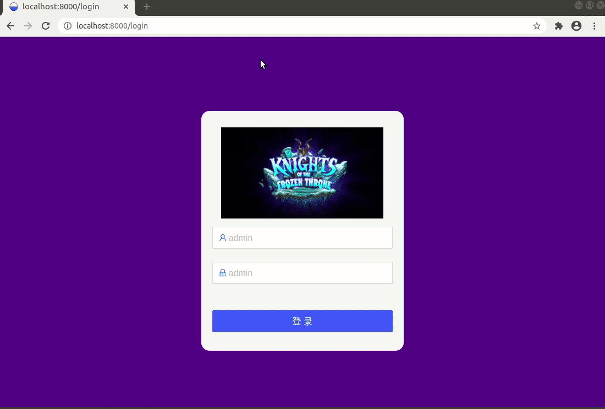
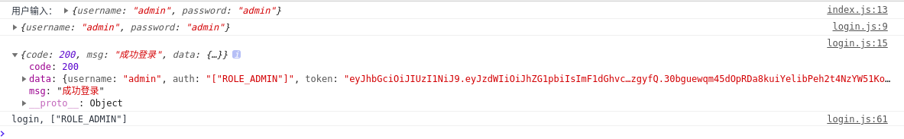

# React + UmiJS:  实现简单登录鉴权

在之前的文章[Spring WebFlux (7): Springboot Security+jwt登录鉴权](https://blog.csdn.net/tonydz0523/article/details/108065025)实现了后端的鉴权登录，只是通过postman进行了测试，本篇以此为基础通过reactjs和umijs架构编写一个前段登录界面，简单测试登录，页面如下功能：

+ 登入，访问后端api获取token以及权限信息
+ 登入后实现跳转
+ token信息和roles放入localStorage中
+ 其他路由设置访问权限，通过wrappers进行权限判断
+ 登出，擦除localStorage信息，跳转到login界面

技术栈：

大体就是蚂蚁金服的react架构哪些东西

+ node    12.18.2
+ yarn   1.22.4
+ umi  3.x
+ antd
+ react 16


## UmiJS简介

官网：https://umijs.org/zh-CN

蚂蚁金服开发的前段架构，antdpro就是使用的umi实现的，感兴趣可以看一下官方文档。

个人体验主要特色就是业务分层明显，集成dva，Redux， redux-saga， 等优秀组建，访问api等功能通过serveices层实现，内部redux通过models层实现，通过命名空间区分不同的store以及对应的函数及副作用，实现功能模块的纵向管理，路由统一管理，之前鉴权不是很方便，现在通过使用`@umijs/plugin-access`插件处理鉴权也很方便，而且大厂加持，可以安利一波

不过现在基本都是在用ts实现，看源码费点劲，不过自己写到时可以使用js，不过ts是趋势，只会js的同学是时候学习ts了。


## 实现

### 先看一下效果：




### 1. umi创建项目

推荐使用yarn管理依赖：

```sh
 npm i yarn tyarn -g
```

随便创建一个目录

```bash
mkdir myapp && cd myapp
```

创建一个项目，github上拉取一个base项目：

```sh
yarn create @umijs/umi-app
```

安装依赖：

```bash
yarn
```

到这里就创建好了一个基础umi框架的app

### 2.  编写login功能model

+ login相关的功能，命名空间：login
+ 因为获取的token和roles在localStorage中存储，因此不需要state
+ 主要就是login和logout两个方法，一个用于登录，一个用于退出摖除数据
+ 具体实现逻辑可以参考一下redux-saga

```js
import { stringify } from 'querystring';
import { history } from 'umi';
import { accountLogin, getPageQuery } from '../services/login';

const Model = {
  namespace: 'login',   // 命名空间
  state: {},   // store 数据

  effects: {    // 副作用 *的是异步方法
    *login({ payload }, { call, put }) {
      const response = yield call(accountLogin, payload);

      if (response.code === 200) {
        yield put({
          type: 'changeLoginStatus',
          payload: response,
        });
        const urlParams = new URL(window.location.href);
        const params = getPageQuery();

        let { redirect } = params;

        if (redirect) {
          const redirectUrlParams = new URL(redirect);

          if (redirectUrlParams.origin === urlParams.origin) {
            redirect = redirect.substr(urlParams.origin.length);

            if (redirect.match(/^\/.*#/)) {
              redirect = redirect.substr(redirect.indexOf('#') + 1);
            }
          } else {
            window.location.href = '/';
            return;
          }
        }
        redirect = redirect === 'login'? '/':redirect;
        history.replace(redirect || '/');
      }
    },

    logout() {
      localStorage.removeItem("token");
      localStorage.removeItem("roles");
      // 不是login界面的话跳转到login界面
      if (window.location.pathname !== '/login') {
        history.replace({
          pathname: '/login',
          search: stringify({
            redirect: window.location.href
          }),
        });
      }
    },
  },

  reducers: {  // effect获取数据处理方法
    changeLoginStatus(state, { payload }) {
      localStorage.setItem("token", payload.data.token);
      localStorage.setItem("roles", payload.data.auth);
      console.log(`login, ${payload.data.auth}`);
      return { ...state};
    },
  },
};
export default Model;
```

model中通过`yield call(accountLogin, payload)`通过api异步获取数据，下面介绍获取数据写法。

### 3. 获取数据的service编写

+ 使用umi-request，访问api
+ api创建[Spring WebFlux (7): Springboot Security+jwt登录鉴权](https://blog.csdn.net/tonydz0523/article/details/108065025)有写，需要添加跨域处理

```js
export async function accountLogin(params) {
  const {username, password} = params;
  const data = {username, password};
  console.log(data);

  return request('http://localhost:8080/auth/login', {
    method: 'POST',
    data,
  }).then(function(response) {
    console.log(response);
    return response;
  }).catch(function(error) {
    console.log(error);
  });
}
```

### 4.  编写login页面组建

+ 主要就是登录表单
+ 编写onSubmit执行函数
+ 函数关联models
+ 登录表单使用的antdpro的登录表单
+  @connect() 写法需要注意

```js
export default @connect() class extends Component {

  onSubmit = values => {
    console.log("用户输入：", values);
    this.props.dispatch({ type: "login/login", payload: values });

  };

  render() {
    return (
      <div className={styles.normal}>
        <div style={{'height':'20%'}}> </div>
        <div className={styles.main}>
          {/* logo */}
          
          {/* 登录表单 */}
          <LoginForm onSubmit={this.onSubmit}>
            <UserName
              name="username"
              placeholder="admin"
              rules={[{ required: true, message: "请输入用户名" }]}
            />
            <Password
              name="password"
              placeholder="admin"
              rules={[{ required: true, message: "请输入密码" }]}
            />
            <Submit>登录</Submit>
          </LoginForm>
        </div>
      </div>
    )
  }
}
```

### 5. 设置路由

umi的路由设置在配置文件中，可以在设置在`.umirc.ts`中，也可以新建config文件夹进行设置

[更详细的路由设置见官网](https://umijs.org/zh-CN/docs/routing)

```java
routes: [
  { path: '/login', component: '@/pages/Login/index'},
  {
    path: '/',
    component: '@/layouts/index',
    wrappers: ['@/wrappers/auth'],
    routes: [
      { path: '/user', component: '@/pages/index' },
    ],
  },
],
```

这里我对`/`设置了鉴权，通过wrappers中的模块进行

### 6. 编写鉴权模块

+ 根据localStorage中存储的roles信息判断是否登录，有无权限
+ 没有登录跳转到登录页面
+ 没有权限调回之前页面等功能

```java
export default (props) => {
  const isLogin = localStorage.getItem('roles') !== null;
  if (isLogin) {
    let roles = JSON.parse(localStorage.getItem('roles'));
    roles = typeof roles === "string" ? [roles]: roles;
    const isAuthorized = roles.indexOf("ROLE_ADMIN") !== -1;
    if (isAuthorized) {
      return <div>{ props.children }</div>;
    }
  }
  return <Redirect to="/login" />
}
```

### 7. 测试

登录过程log情况：




## 原码

github